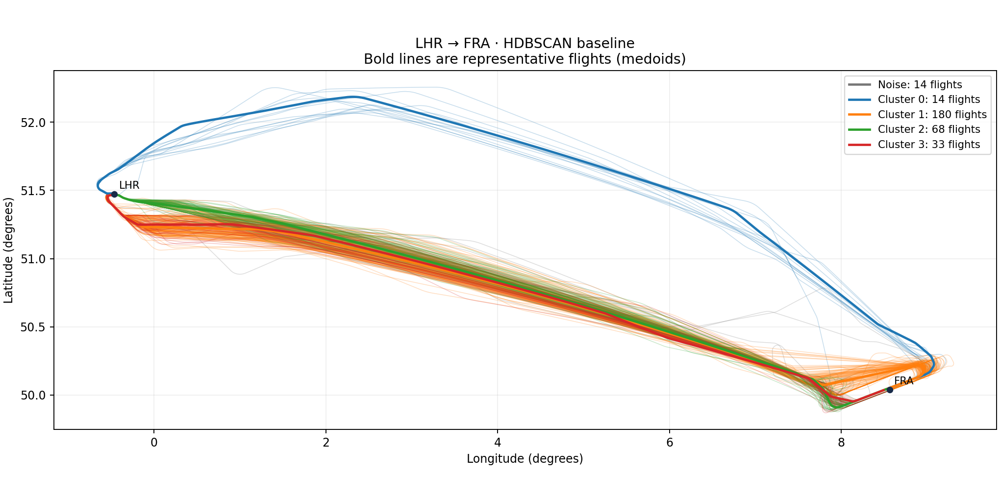

# LHR to FRA flight trajectory clustering

Application of Aerospace Artificial Intelligence, Sejong University, Fall 2026.

This project groups real London Heathrow to Frankfurt trajectories using HDBSCAN and investigates unusual horizontal route shapes. The working dataset is Lufthansa callsign **DLH5H**, aircraft type **A20N**, in **2025**.

## Results

| Stage | Result |
|---|---:|
| Source observations | 348 flights, 1,242,998 points |
| Point cleaning | 224 rows removed |
| Accepted for clustering | 309 flights, 1,121,503 points |
| Held for data-quality review | 39 flights |
| Working HDBSCAN setting | `min_cluster_size=10`, `min_samples=5` |
| Cluster sizes | 14, 180, 68, 33 |
| Noise | 14 flights (4.53%) |
| Persistent candidates across the tested grid | 2025-06-01, 2025-07-27, 2025-09-04 |

The working setting preserves a coherent 14-flight northern route group. It is an exploratory choice supported by the parameter comparison and visual inspection, not an automatically proven optimum. The original `(15, 5)` comparison has three clusters and 28 noise flights. All 15 parameter combinations are included.



## Start here

- [Presentation](presentation/LHR_FRA_HDBSCAN_Presentation.pptx) and [15-minute speaker notes](presentation/SPEAKER_NOTES.md)
- [Method and limitations](docs/METHOD.md)
- [Results and outlier analysis](docs/RESULTS.md)
- [Data inventory and provenance](data/README.md)
- [AI disclosure](docs/AI_DISCLOSURE.md) and [team submission checklist](docs/SUBMISSION.md)

## Install and run

Clone a **fresh folder**. The prepared dataset is a regular compressed Git file, so it is available without downloading the 435 MB raw LFS object. Windows CMD:

```bat
set GIT_LFS_SKIP_SMUDGE=1
git clone https://github.com/sayenooo/flight-trajectory-analysis.git flight-trajectory-analysis-final
set GIT_LFS_SKIP_SMUDGE=
cd flight-trajectory-analysis-final
python -m venv .venv
.venv\Scripts\activate
python -m pip install -r requirements.txt
python run_pipeline.py
```

On macOS/Linux, use `GIT_LFS_SKIP_SMUDGE=1 git clone ...` and activate with `source .venv/bin/activate`. Python 3.11–3.13 is suitable for the pinned dependencies.

`run_pipeline.py` checks that the saved distance matrix matches the prepared-file hash and accepted flight order. It reuses a matching matrix or rebuilds it when required, then runs both HDBSCAN settings and the candidate review. Derived results are updated. A full distance rebuild takes several minutes:

```bat
python run_pipeline.py --rebuild-matrix
python -m unittest discover -s tests -v
```

To reproduce preprocessing from the original raw observations, download the retained LFS source first:

```bat
git lfs install
git lfs pull --include="data/lhr_fra_2025/DLH5H_A20N_2025_ALL_POSITION_POINTS.csv" --exclude=""
python run_pipeline.py --from-raw
```

`--from-raw` recreates prepared data and derived results, while leaving the raw source unchanged. Do not replace a matrix or sort its flight-ID file independently of the other outputs.

## Repository map

| Location | Purpose |
|---|---|
| `src/` | Four scripts for preparation, distances, clustering and candidate review |
| `run_pipeline.py` | One command for the documented analysis |
| `tests/` | Focused geometry, cleaning and cache-provenance checks |
| `data/lhr_fra_2025/` | Original LHR–FRA source and flight metadata |
| `data/lhr_fra_prepared/` | Cleaned points, acceptance list and quality audit |
| `data/lhr_fra_hausdorff/` | Full-resolution distance matrix and matching flight order |
| `data/lhr_fra_hdbscan_mcs10_ms5/` | Main result and complete parameter comparison |
| `data/lhr_fra_hdbscan_mcs15_ms5/` | Original baseline for comparison |
| `data/lhr_fra_candidate_review/` | Three persistent candidate cases |
| `presentation/` | Editable slides and speaking notes |
| `docs/` | Method, results, attribution and submission guidance |
| `experiments/` | Retained teammate work on downsampling and visual QC |

The main analysis uses all accepted observations, with no interpolation or downsampling. The teammate's optional 10/30/60-second experiments have separate output folders and do not replace the main matrix. See [experiments/README.md](experiments/README.md).

## Interpretation

The metric compares horizontal point sets and ignores time ordering, altitude and speed. Noise labels identify geometric review candidates. Weather, runway, ATC causes, fuel savings and safety implications have not been established. The 39 flights held for quality review differ from the 14 HDBSCAN noise flights.

The old ICN–FRA Excel workflow was removed from the current tree during the LHR–FRA cleanup. Its files remain in Git history. See [the cleanup record](docs/REPOSITORY_CLEANUP.md). No repository history was rewritten.

Data source: OpenSky Network, supplied through the team repository. Library implementation: `sklearn.cluster.HDBSCAN`. ChatGPT/Codex assisted with code, checks, interpretation and presentation preparation. Team members must confirm their contributions before submission. This repository does not claim a from-scratch HDBSCAN implementation.
