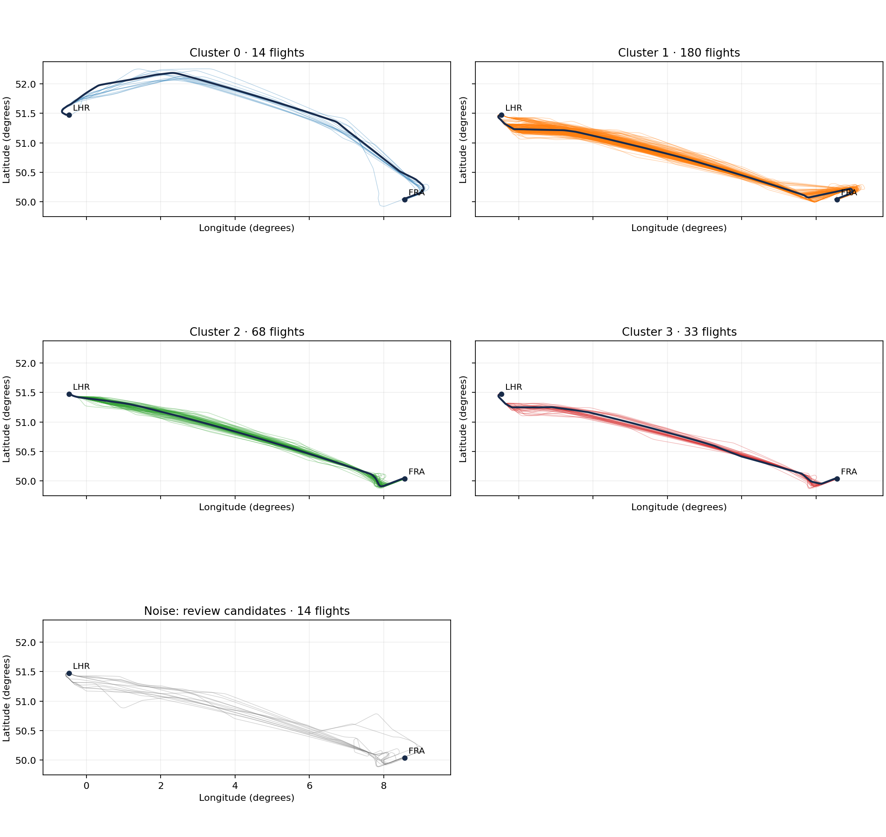
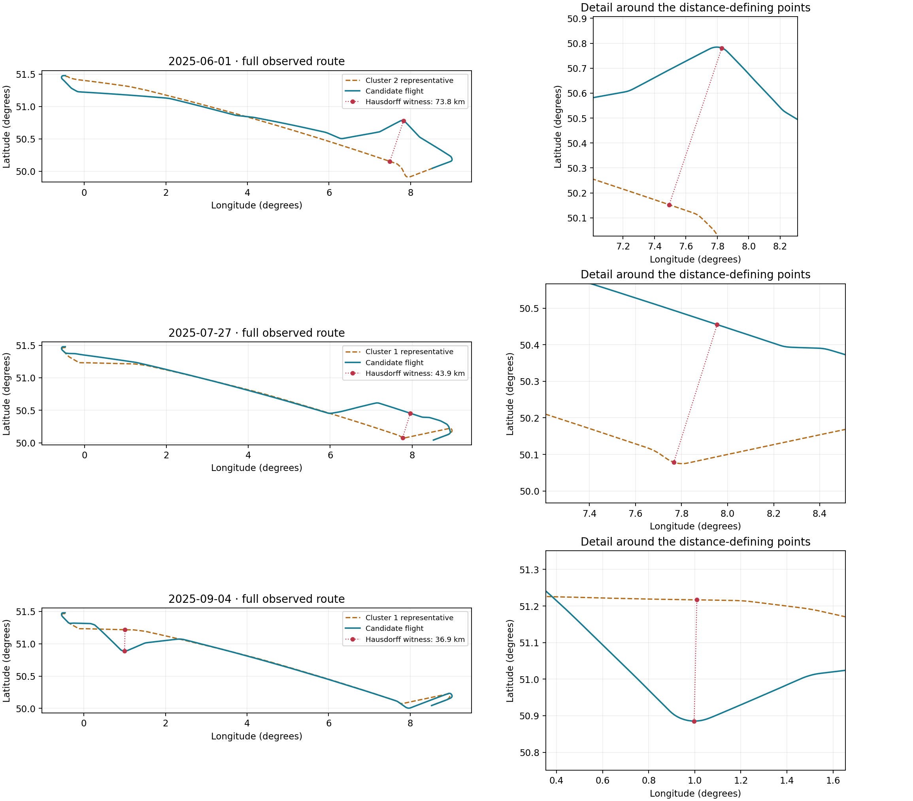

# Results

## Working configuration

309 accepted flights, minimum cluster size 10 and minimum samples 5.

| Label | Flights | Share |
|---|---:|---:|
| Cluster 0 | 14 | 4.53% |
| Cluster 1 | 180 | 58.25% |
| Cluster 2 | 68 | 22.01% |
| Cluster 3 | 33 | 10.68% |
| Noise | 14 | 4.53% |

Cluster 0 follows a northern arc. The larger groups share much of the main corridor, with visible differences near the airports. These observations describe geometry and do not identify operational causes.

## Parameter sensitivity

Each cell is **number of clusters / number of noise flights**.

| Minimum cluster size | Minimum samples 5 | Minimum samples 10 | Minimum samples 15 |
|---:|---:|---:|---:|
| 5 | 4 / 14 | 4 / 22 | 2 / 17 |
| 10 | 4 / 14 | 4 / 22 | 2 / 17 |
| 15 | 3 / 28 | 3 / 36 | 2 / 17 |
| 20 | 3 / 28 | 2 / 17 | 2 / 17 |
| 30 | 3 / 28 | 2 / 17 | 2 / 17 |

The same 180-flight group persists across the grid. Changing (15,5) to (10,5) preserves the membership of the 180, 68 and 33 groups, and turns 14 former noise flights into a separate group. This explains the working choice. Reduced noise alone is not an optimization criterion.

## Representatives

The full identifiers and medoid indices are in `data/lhr_fra_hdbscan_mcs10_ms5/cluster_representatives.csv`.

| Cluster | Representative date (UTC) | Median distance to medoid (km) |
|---:|---|---:|
| 0 | 2025-10-27 | 16.22 |
| 1 | 2025-08-26 | 10.95 |
| 2 | 2025-10-12 | 8.45 |
| 3 | 2025-01-17 | 7.82 |

## Persistent geometric candidates

| Date | Nearest-medoid Hausdorff (km) | Maximum position gap (s) | Visible difference |
|---|---:|---:|---|
| 2025-06-01 | 73.80 | 6.60 | Northern deviation later in the route |
| 2025-07-27 | 43.94 | 5.15 | More northerly path near arrival |
| 2025-09-04 | 36.87 | 6.43 | Southern deviation early in the route |

All three remain noise across the 15 tested settings. On July 27, the medoid-to-candidate direction controls the symmetric maximum. The distance is a point-set separation, not extra kilometres flown. The short gaps do not explain the differences through the earlier multi-hour-coverage problem, but do not rule out every possible data error.

Noise frequency distribution across all 309 flights: 273 never noise, 8 noise in 3 settings, 11 in 8 settings, 14 in 11 settings, and 3 in all 15 settings. These frequencies are descriptive.

Sources: the committed parameter, label, representative, QC and candidate-review tables. See METHOD.md for limitations.
